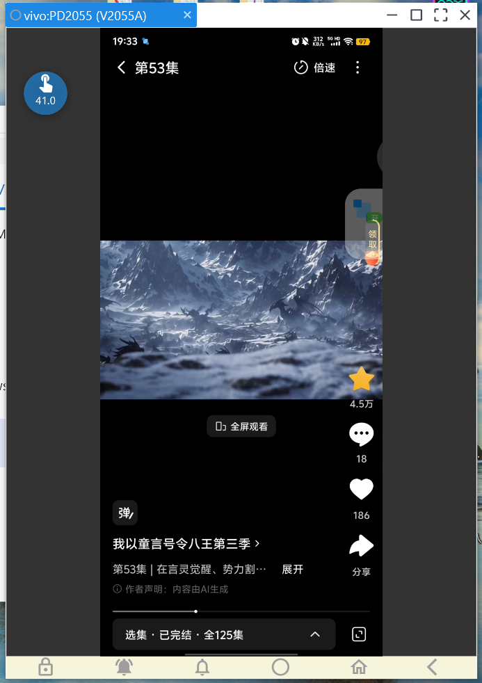
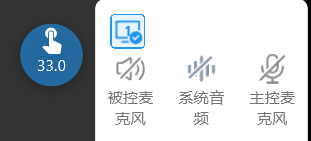
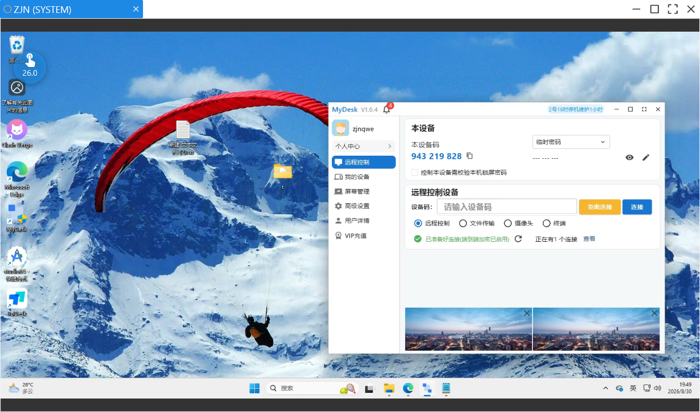
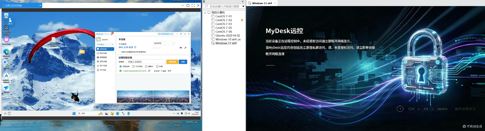

**English** | [简体中文](README-ZH_CN.md)

# MyDesk

A remote control tool that's still growing up.

---

## What it does

MyDesk is a cross-platform remote control app that lets you reach your own computer from your phone or another computer, whenever you need to:

- **Cross-platform**: Windows / macOS (not released yet) / Linux (not released yet), plus iOS (not released yet) / Android phones — they can all connect to each other.
- **Live screen**: the remote screen is streamed over WebRTC with low latency — you can see it, and operate it.
- **Privacy screen**: the controlled side can black out its local screen to prevent snooping, and block stray mouse and keyboard input.
- **Shared clipboard**: copy and paste text between two devices — no more routing things through a chat app.
- **Bring your own relay**: run your own coturn relay with one command, and your session traffic stays on infrastructure you control — it never touches our servers. Heavy users won't get throttled or pushed off for using too much. See [self-host/](self-host/README.md).
- **Web client**: control your computer from any browser, without installing anything on the controlling side.

## Screenshots

Windows controlling Android

Microphone audio from both sides, plus the other side's system audio

Windows controlling Windows

Windows privacy screen

## Self-hosting (bring your own relay)

Don't want your sessions to depend on our servers? You can run your own relay — it
takes **one command**, and your data never passes through us. It's the same
mechanism our own relay nodes use. Step-by-step guide and the deploy script live in
[self-host/](self-host/README.md).

## Why we built it

Remote control software out there tends to be either expensive, a little hard to trust with your privacy, or so stuffed with features that it's actually hard to use. We wanted to make a remote control tool that is **lightweight, transparent, and good enough** — one that does the common scenarios well.

## Where it is right now (please bear with us)

Honestly, it's still far from "finished":

- Mobile and some platforms are still being polished, so details may not be perfect
- On some flaky networks, the connection can be unstable
- The docs are incomplete — troubleshooting may take a bit of patience

So right now it's more of a **work in progress** — but we'd rather have it improve little by little through real use than hole up and build it in private.

## You're welcome to try it

That's exactly why we're putting this out: **we hope you'll actually use it.**

- If something works well, tell us — it gives us momentum
- If something doesn't, tell us even more — that's where we need to improve
- If there's a feature you want that isn't there yet, say so — we'll put it on the roadmap

Any feedback — what worked, what didn't, ideas, complaints — is fuel for this project to move forward.

## How to give feedback

- Leave your experience and thoughts below
- Or contact the author directly with whatever you ran into

Without your real feedback, it's hard for it to grow. Thanks in advance to everyone willing to give it a try.

---

*MyDesk — a remote control tool that's still growing up.*
